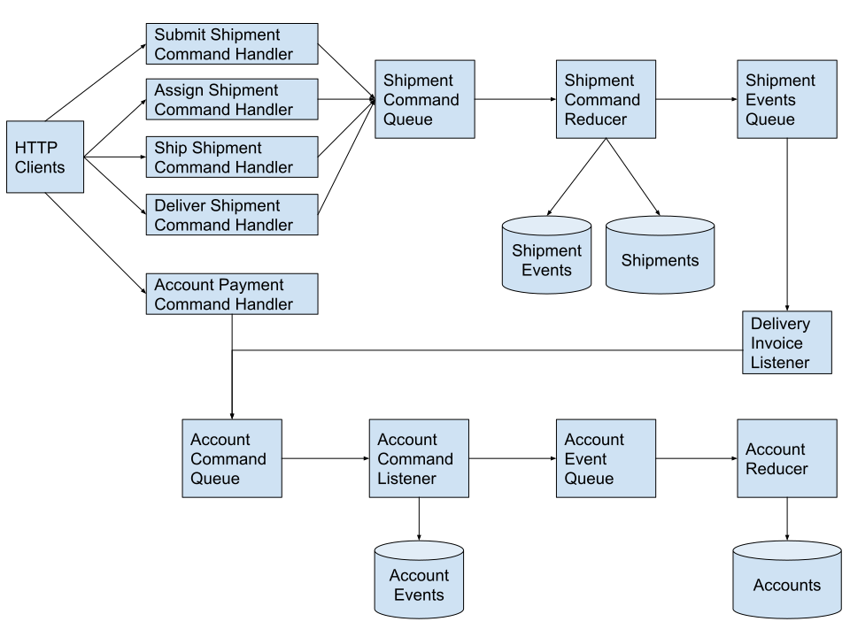

## Outline

1. [Intro (What is it?)](#Introduction)
    1. business explanation (Hypothetical business case)
    2. the problem + typical mindset
    3. a different way of thinking about the problem wrap up intro with a change of thought: "rather than storing state, if we stored activities, then...x, y, z"
2. Body (How was it implemented?)
    1. [Description of terms](#Description-of-Terms)
        - Event Sourcing
        - CQRS
    2. [High-level architecture overview](#Architecture)
        1. emphasize that this approach uses off-the-shelf components (**not** specialized tools)
    3. [Start diving into the implementation](#Implementation)
        1. [Shipment handler](#Shipment-Handler)
            - data coming in can be "bad" (repeat requests, invalid data per schema, etc.)
            - cannot both save data and broadcast events because of durability (atomic operation)
            - talk about queue implementation (need for partitioning and key)
        2. [Shipment reducer](#Shipment-Reducer)
            - single-threaded in order to enforce data consistency + order of shipment events
            - Produces events as output + updates event store (data store? db? which term do we want to use?)
            - Safe to mutate multiple things because failure will cause the message to be reprocessed.
            - Discuss the need for an aggregate (can't rollup on the fly, need to search, need to ensure valid transitions)
        3. [Cross-domain listener](#Cross-domain-listener) (Shipment -> Accounting) (Aabristi)
            - In a normal organization, handling shipment logistics and accounting/billing would be done by different teams
            - This could go on the shipment side or the accounting side
                - On the shipment side it makes logistics dependent on accounting.
                    Shipments "push" a command to the accounting system
                - On the accounting side it make accounting depend on logistics.
                    Accounting listens to shipments and reacts as an interested party
        4. [Accounting handler](#Accounting-Payment-Handler)
            - validates command against schema
            - sends a command into the accounting-command topic
        5. [Accounting command listener](#Accounting-Command-Listener)
            - stores transactions
            - single-threaded to make sure that duplicate transactions are not created
        6. [Account reducer](#Account-Reducer)
            - updates a snapshot of the account with a balance as transaction events are received
            - single threaded to make sure that transactions are not double counted or missed
        7. List shipment handler
            - Illuistrate the need to have aggregate roots
3. [Conclusion](#Conclusion)
    1. Not the solution to all problems
        1. What is it good for / pros (Paul R)
            1. isolating different parts of a business process
            2. isolating different parts of the system
            3. Can use familiar technologies and libraries
            3. easier to change business rules over time
            4. support rich auditing/analytics (keeping all events)
            5. handling heavy regulitory/compliance requirements (approvals, SLAs etc)
        2. What is it bad for / cons (Paul R)
            2. More complicated to reason about
            3. Not all changes are instance (eventual consistency). Time constrained my not be a good fit
            4. "edit" based workflows where a user can arbitrarly update many fields at his/her discression (bad for updating a profile maybe)
    2. Not better or worse, just another tool in your toolbox.
        omething to consider when working on your next project.

## Introduction

Software development teams are responsible for building a wide variety of software to solve a wide variety of problems.
Many of these software development projects start with a series of meetings and interviews with experts in the business domain to understand the problem and start to formulate solutions.

Suppose your team has been asked to work with *Great Plains Trucking* to help automate and streamline their operations.
Managing shipments by hand via emails and spreadsheets is becoming too much.
You meet with Amy, the chief operating officer:

> "Let me start with an overview of our business process.", Amy begins, "Typically, a customer will call customer service with a shipment. We take down their information and give them the cost. The representative then sends an email to dispatch.

> Dispatch finds a truck that is available to pick up the shipment and adds the shipment to a shared spreadsheet of trucks to mark that truck as occupied. Dispatch calls the driver and lets them know the pickup address.

> The driver picks up the shipment and takes it to the destination address.

Once the shipment has been delivered, and the recipient has signed for it, the driver tells dispatch and dispatch marks the shipment as complete and the truck as available in the spreadsheet.

Dispatch then sends an invoice over to finance with the customer account number and price."

> Finance has a spreadsheet for each customer where they track their shipments a well as payments received."

> A teammate asks, "What is the one biggest challenge with your process." Amy replies, "Each of these departments has built its own spreadsheet or email process to handle operations.
We want the departments to have better visibility into what is going on with a shipment.
If a customer calls us to ask why a shipment has not yet been picked up, Customer service has to call dispatch to figure out if they have sent a truck."

> "What kind of information is needed by customer service when a customer calls in?" asks another teammate.
"Not a lot is needed to start the process.", replies Amy, "We need to know the customer account number, the pickup address, destination address, and weight."

The above narrative outlines a common project in software development.
In this project, the software is being used to replicate and codify a business process.
Developers familiar with [Domain driven Design]() will quickly identify the business entity of *Shipment*. Each shipment would have several fields of data.
Amy listed many of these fields: the customer, from address, destination, weight, truck, as well as some sort of "status."

Generally, these kinds of projects are implemented as [CRUD] applications that manage these business entities.
Because this is going to be the system of record for shipments, the team decides to build a REST service to expose the data so that multiple applications can access it.
A shipment table can be created in a database and a column added for each field.
A get endpoint (/shipments) can be created to list all the shipments.
A post endpoint (/shipments) can be built to create a shipment.
And finally, a PATCH endpoint (/shipment/{shipmentId}) can be used to modify a shipment.

The above process is straightforward on the surface, and many successful applications have been built with the above at its core.
However, the design does not speak to the business process Amy laid out.
It also does not address several other non-functional requirements that common sense and follow up interviews would suggest:

1. Events have to happen in a specific order: Shipments cannot be delivered before they are shipped, etc.
2. Shipments can be reassigned to other trucks.
3. The customer account should not be debited until the consignment is delivered and not charged twice.
4. Some fields are required (e.x. truck), but not until a certain point in the process, before that, they are unknown.
5. It is probably important to know when things happened in addition to the current state. When a shipment was shipped vs. delivered, for example.

Any of the above can be implemented as a conditional check when a shipment is modified.
However, these start to compound in complexity.
Validation becomes complicated as some fields are only required in certain statuses, while others are required in other statuses.
Deltas have to be calculated to determine if a shipment is moving from one status to another to decide if a side effect needs to happen (i.e., debiting an account). This forces the concerns of all the business processes together into a monolithic patch endpoint and validator. Over time, as requirements evolve and teams change, it will become even harder to understand and test the process.

### Description of Terms

In this blog, we outline a different way of building applications that implement a business process called *event sourcing*. This design can greatly simplify the implementation of a business process as well as make it easier to modify and extend over time.
This is a change in mindset from storing the "state" of an entity to storing the "transitions" an entity undergoes as business activities take place.
 For the purposes of this explanation, we use the term "event sourcing" to refer to this persistance strategy where individual _events_ are stored as the primary system of record.
The current state of an entity is _sourced_ from those events by aggregating them into a whole.
This is similar to how a data warehouse would store individual fact records and present an average by dividing the sum of a numerator by the sum of a denominator.

We refer to the traditional design of transactional systems that we are most familiar with as "state mutation".
In these systems a user activity is stored by loading _state_ and then _mutating_ that state before saving it back into the database.
Sometimes these systems may also store an audit trail, however this audit is derived from the delta of the _state_.

Command Query Response Segregation (CQRS) refers to an API pattern.
In a state mutation system, an API will typically convey the type of mutation to perform (e.x.
DELETE a record, update a field, create a record, etc.). In a CQRS system, the API instead specifies *commands* that can be submitted by the client and *queries* that can be requested.
This can be compared to the real life example of interacting with a government agency.
If someone wants to make a modification to their home, they do not call the zoning board and "create a building permit".
Rather, they submit a form that specifies the requred and optional information.
This form may be considered a "building permit request". The city then takes this form and based on various rules creates a "building permit".
This pattern still fits well within a RESTful URL scheme:
Each type of commmand has its own URL pattern as a sub-resource of the entity that is being affected and can be submitted with a POST.
The current state of the entity (derived from the events) can be fetched with a GET request along with the collection of events.

### Architecture

Admittedly, the architecture of an event sourced system is more complicated than a state mutation based system.
This complexity stems from the need to enforce a correct order of business events.
In our shipping use case, we must enforce that a shipment cannot be delivered before it is shipped and cannot be shipped until it is assigned to a truck.
We also cannot allow a shipment to be delivered multiple times.

In a state mutation system, because a single record is being modified, optimistic concurrency control or pessimistic locking can ensure that a request cannot process an event while another request is in flight.
Beyond this constraint, our system does not require any specialized software, servers or frameworks.
An event sourced system can be built as a familiar REST API with the same web frameworks the team is comfortable with and backed by the same datastore technologies as traditional systems.

We have created a reference implementation of the above architecture and made it [available on GitHub](https://github.com/sourceallies/event-source-blog).
We have choosen implementations of the components that would be available to the widest audiance of developers.
Depending on your deployment environment (On-Premis or one of the Clouds), you may want to choose different tools.

Our stack consists of the following major components:

- Any application server.
We are using [NodeJS](https://nodejs.org/en/).
- A web framework.
We are using [Hapi](https://hapi.dev), however any library that easily allows the parsing and validation of JSON payloads will work (Spring, ASP.NET, etc).
- Somewhere to store the data.
We are using [MongoDB](https://www.mongodb.com). Any SQL or no-sql database will work.
Note that if a relational database is used, a common query pattern is to get all events tied to a specific entity id regardless of type.
- We need a peristant queue.
This is the one component that may not be present in exising solutions.
Like the other components there are many options.
The only requirement is that the queueing system must support [partitioning of messages](https://activemq.apache.org/how-do-message-groups-compare-to-selectors). Utilizing this feature ensures that two messages that are part of the same "group" or "partition" will not be processed at the same time by different consumers and will be processed in the order they were received.
Essentially, they force that for a given key, processing is single-threaded.
While we are using [Kafka](https://kafka.js.org), [ActiveMQ](https://activemq.apache.org/message-groups.html) and [Kenisis](https://docs.aws.amazon.com/streams/latest/dev/key-concepts.html#shard) also support this feature.

Within our application we will have several handlers responsible for receiving HTTP requests as well as several listeners that receieve messages from queues.
Let us look at these various components and explore how they ensure business rule integrety while maintaining a clear separation of concerns.



### Implementation

#### Shipment Handler

A Hapi handler is created for each shipment command: Submit, Assign, Ship and Deliver.
A handler cannot atomically validate, persist, and broadcast the command for other consumers, so the handler simply validates the structure of the command and publishes it to the command queue.
The handler then provides a successful response to the client, indicating that the message was received.
The recoverability of the queue ensures the command messages will be processed safely and in-order.
However, partitioning is needed to guarantee that two events for the same shipment are not being processed at the same time.
We use the shipment ID as our partition key.

#### Shipment Reducer

The shipment reducer listens for commands published to the command queue.
Like all reducers in the system, it performs two primary tasks:

1. Make the state changes prescribed by each command received on the command queue
2. Publish an event upon successfully processing a command

The shipment reducer publishes events to the shipment event queue after successfully processing a shipment command.
Other components of the system can subscribe to the shipment event queue to perform other tasks, such as account processing.
For example, a "Deliver" command requests that a shipment be moved from the shipped state to the delivered state.
The shipment reducer performs the necessary work and publishes a "Delivered" event.
The account prcessing system can then use this event to debit an account.

The shipment reducer saves the shipment events and the state of each shipment to the data store.
Although the current state of a shipment can always be rehydrated by reprocessing all previous events, the shipment reducer often needs to check that a command is valid for the current shipment state.
Loading (caching) the current state is much faster than having to reprocess all previous events.
Saving the current state of a shipment also improves the performance of external queries such as fetching the current state of a shipment.

When processing commands, the shipment reducer needs to ensure:

1. Commands are processed in-order.
2. Commands do not generate illegal states.

Commands have already been structurally validated by the shipment handler, so the above validation is more concerned with the semantics of a command.
In-order processing is greatly simplified by the single-threaded execution of the handler.
However, this alone does not guarantee commands are processed in-order.
Extraneous circumstances such as network errors can cause command duplication or redelivery.
Accordingly, the reducer saves the timestamp of the last command processed for a shipment and rejects any commands with an older timestamp.

The shipment reducer will reject any commands that would generate illegal state transitions.
Knowing which commands to reject is part of the core business logic.
For example, an "Assign" command cannot be applied on top of a shipment that's already in the "Shipped" state.
If this were to occur, the shipment reducer would not update the shipment state or publish an event.

The core behavior of the shipment reducer can be found in these four lines within `processCommandListener.js`:

```js
const updatedShipment = reducer(loadedShipment, command);
await saveEvent(command);
await publishEvent(command);
await saveShipment(updatedShipment);
```

These statements are specifically ordered to ensure that the shipment reducer can recover from any critical errors.

- The `reducer` function updates the state of the shipment in memory.
If the shipment reducer were to fail immediately after this statement, the system can recover by reloading the shipment state and reprocessing the current command.
Since no events have been published, the downward components of the system are still in a consistent state.

- The `saveEvent` function saves the event to the data store.
If the shipment reducer were to fail immediately after this statement, the system can recover by comparing the timestamp of the last event in the data store and the last published event.
The shipment reducer can then publish any event that wasn't published successfully.

- The `publishEvent` function publishes the event to the event queue.
Downward components of the system will receive the event after it's published.
To recover from failure, the shipment reducer only needs to re-update the shipment state with the most recently published event.

- The `saveShipment` function saves the shipment state to the data store.
At this point the command has been processed in its entirety.

#### Cross-domain Listener

While working on the project, team realized in a normal organization the shipment logistic and accounting would be handled by different departments.
To resolve this issue, system needs to introduce a command to another department for the further process.
To avoid double billing a customer, a cross-domain listener is added to system.

For real life implementation, cross domain listener can be added on either side of the system: account or shipment.

- In this example delivery invoice listener is added to the system as a cross domain listener.
To setup cross domain listener in shipment department, listener needs to listen to shipment event queue and create an account command.
When the event occurs, shipment department will receive the event, validates, processes, saves the event, and adds the shipment events in the queue.
Then job of delivery invoice listener is to listen to events in queue and send command to account handler with `shipmentId`  when shipment event has `Delivered` status.
This way account department will process to charge the specific account only for delivered shipment.

- To set up cross domain listener in account department, listener needs to listen to the both shipment command and account command when event occurs.When the event occurs, account department will receive the event, validates, processes,sends command to the shipment department for the given account.

#### Accounting Payment Handler

Users will need a way to settle their accounts.
There is a Hapi payment handler that allows clients to post payments.
Similar to the shipment handlers, the payment handler is responsible for validating the stucture of a payment request and acknowledging receipt to the client.
Valid commands are published to the account command queue for further processing.

#### Accounting Command Listener

As with shipments, there is a listener responsible for processing all of the account commands.
This listener is responsible for storing the accounting command as an accounting event (aka "transaction"). It is important that we do not double-charge or double-credit an account.
We ensure this by having the publisher of a command assign a unique `_id` field to each accounting command.
This listener then uses this field to de-duplicate commands to make sure that we do not process the same commad twice.

#### Account Reducer

Having a list of transactions is a good source of truth for an account.
In order to get the balance of an account we can simply sum up all of the transactions tied to that account.
This works, but isn't very pratical.
As the number of transactions grows over time, this can become a slower and slower operation.
It is also difficult to find all of the accounts that have a certain balance (To send reminders for example). We can solve this problems by creating an aggregate record that represents the current state of an Account just as we did with Shipments.

The account event reducer is responsible for listening to account related events, loading the account if it exists and updating the balance.
The challenge is finding a way to prevent double counting an event if we fail to acknowledge the message.
The reducer uses a high water mark to track the timestamp of the last event it has applied to an account on the account.
If the lastEventTimestamp is greater than or equal to the timestamp of the event we just received, then we know we have already added the amount to the account and can ignore the message.

## Conclusion

Now that we have covered all of the components that make up the *Great Plains Trucking* system, we can talk about some of the benefits of this kind of architecture.
The first, and probably greatest, benefit of an event sourced system is isolation.
It isolates different business processes from one another.
A change to the rules for accepting a shipment do not affect the rules for delivering a shipment or paying an account.
This isolation is also reflected in the code.
A traditional REST based state mutation system would need to add more rules to the same handlers to determine who can save a record (depends on the state) and what makes a record valid (depends on where it is in the process).
This makes it hard to reason about the effects that changing one process has on the behavior of others.
In our system, each handler is responsible for validating the structure and security of one step in the process and is isolated and independent of the others.

While there are libraries and frameworks specific to event sourcing, they are not needed to implement this pattern.
Our application uses well tested and familiar frameworks and tools (NodeJS, Hapi, MongoDB).
The only specific requirement is the ability to queue messages and procesess them synchronously within each entity.
Because of this, event sourcing can be leveraged within existing teams and applications as appropriate.

Most applications, sooner or later, will require some level of auditing and history tracking.
Often, this is bolted on later in the form of database triggers or some audit tables that are written to as the application updates data.
These solutions often cause the main system to become more complicated as they are shoe-horned into an architecture that was not initially designed for them.
They also suffer from lack of context: an audit table can track that a user changed a value from "27" to "20" on a particular date, but cannot track why that value changed (e.x.
was a payment made, or a refund issued?).
Event sourcing naturally tracks these events as the source of truth and leverages this data as an asset to the wider system rather than a burden.
This feature is doubly important in systems that have regulatory requirements around auditing such as healthcare and financial systems.

We are not here to claim that event sourcing is the best architecture for every project.
In fact, it is probably a poor choice the majority of the time.
This architecture has more moving pieces than a state mutation based system.
This leads to extra complexity if the application never adds enough business process to take advantage of it.
A system that allows users to modify data without a prescribed process (i.e.
modifying a user profile) doesn't need event sourcing and there would typically only be one type of event "update X".

Another characteristic is that state is mutated *eventually* and not directly.
It is possible for clients to submit a command and then query up the state of an entity and not see the command applied yet because it is still being processed.
It is also possible for a command to be submitted successfully but then be rejected by the command handler because the state of the entity changed while the command was in flight.
Clients would need the ability to check on the status of a command or be notified when a command is rejected.
Mitigating these shortcomings can result in additional complexity for both the server and clients if visability into these scenerios is needed.

In this blog we hope to give teams another architectural tool, along with an [example implementation](https://github.com/sourceallies/event-source-blog)
When appropriate, it can help make some of the most complicated applications in the enterprise easier to maintain, change, and reason about.


